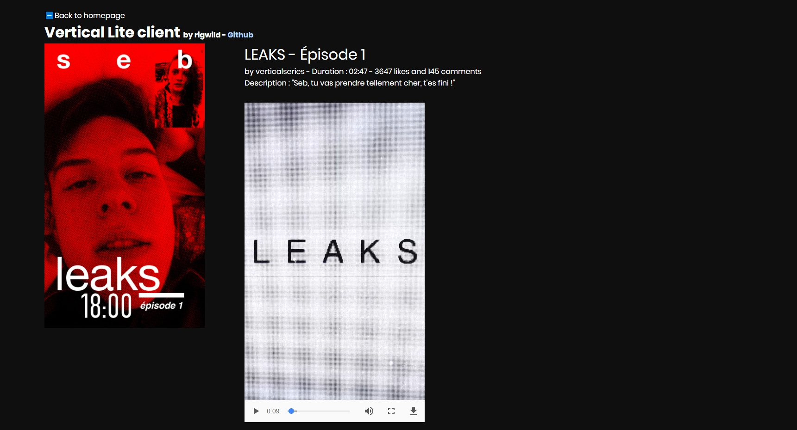

# appVertical-lite-client-JS

##  IMPORTANT NOTICE
**App Vertical closed its service. This no longer works. This repo will be updated if the service open again.** 

## Introduction
This is a web lite client for the french application "**Vertical**". It's a service which provide application exclusive videos. I sniffed packets coming in and out of the application to understand how the API works and how to replicate the application requests.
This means that you don't need to download the application and you can watch their videos on your computer or mobile phone. It's responsive.
Nothing is hosted on your web server, you just retrieve data remotely from Vertical servers.

PHP version is available here : [https://github.com/rigwild/appVertical-lite-client-PHP](https://github.com/rigwild/appVertical-lite-client-PHP)

## Configuration
Modify these lines in script.js with your account details. A test account is already there, please don't change its password.
```
/*Login details to change*/
const user = "testazerty"
const pass = "testazerty"
```
You are good to go. In this new Javascript version, the access token and the home page videos are stored in cache (Session Storage) so it can be very quick to load.
Keep in mind that Cross Origin Policy prevents Javascript to load external content. That's why i'm using CORS Anywhere, a NodeJS proxy, so you don't have anything to install. If you want to run your own instance of CORS Anywhere, alter this line with your server's details.
```
//Bypass Cross Origin Policy
const corsProxy = "https://cors-anywhere.herokuapp.com/"
```
You can find CORS Anywhere Github repository here : [https://github.com/Rob--W/cors-anywhere](https://github.com/Rob--W/cors-anywhere).
When you login, your access token and the home page videos are cached, so it can load faster.

## Demo
~~You can test it live here~~ : **App Vertical closed its service.**

## Screenshots
Mobile view :


Computer view :



